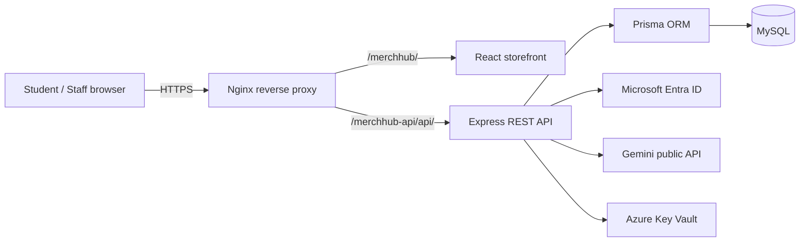
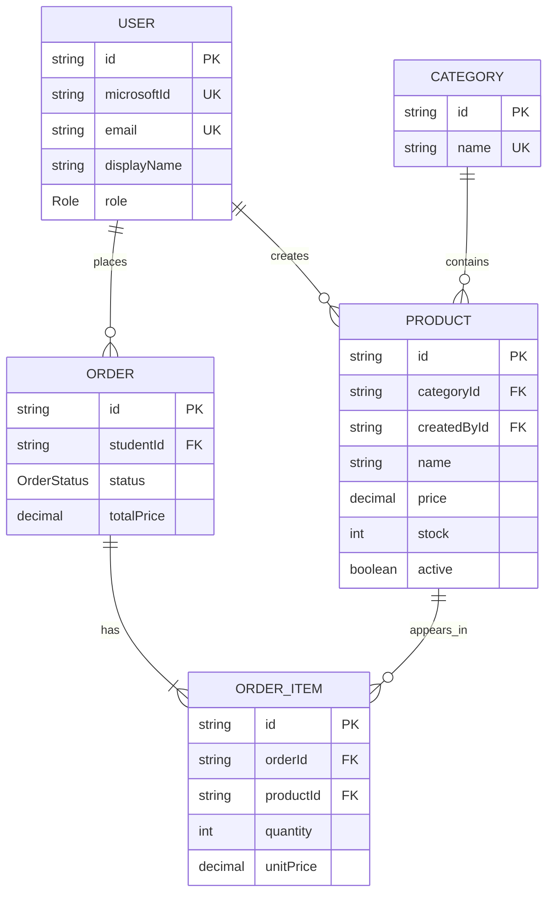

# AU MerchHub Design Document

## Purpose

AU MerchHub is a university merchandise store. Students sign in with their
university Microsoft account, browse products, place orders, and view their
orders. Staff maintain the catalogue and process orders. Administrators also
manage categories and user roles.

## Architecture

Nginx terminates TLS and keeps the existing `/content` and `/api` routes
untouched. The API binds only to `127.0.0.1:3001` on the host. In production,
the application obtains `database-url`, `app-jwt-secret`, and
`gemini-api-key` from Azure Key Vault before it initializes Prisma.

## Authentication and RBAC

1. The React client signs in through Microsoft Entra ID using MSAL.
2. It sends the Microsoft ID token to `POST /api/auth/microsoft`.
3. The API validates signature, issuer, audience, tenant, expiry, and optional
   university email domain.
4. The API issues a one-hour application JWT.
5. Protected endpoints reload the user's current database role, so a role
   change takes effect without waiting for an old token to expire.

| Role | Permissions |
| --- | --- |
| STUDENT | Browse products, create orders, view own orders |
| STAFF | Manage products and process all orders |
| ADMIN | Staff permissions plus categories and user roles |

## ERD

## Integrations

- **Microsoft Entra ID:** university identity provider.
- **Azure Key Vault:** production secret source; no production `.env` file.
- **Gemini:** generates product descriptions for authorized staff.

The lecturer's latest instruction removed the peer-team API requirement. Gemini
therefore provides the required public third-party API demonstration.

## Deployment and security controls

- Multi-stage Docker image and non-root runtime user.
- Database migration runs as a separate one-shot Compose service.
- API port is published on loopback only.
- Nginx TLS termination and isolated URL prefixes.
- Helmet security headers, request body limit, JWT expiry, server-side RBAC,
  input validation, and secrets excluded from Git/Docker build context.
